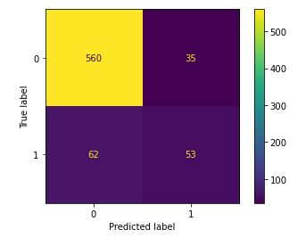
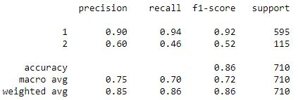
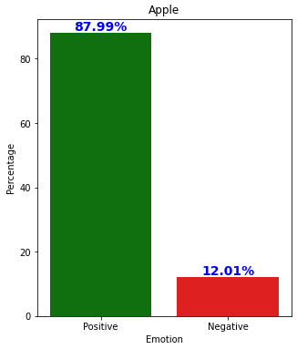
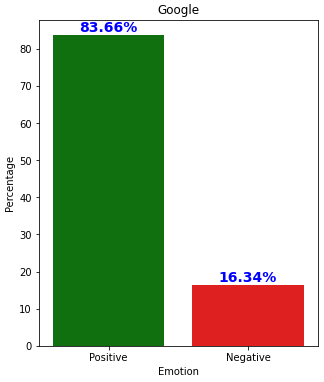
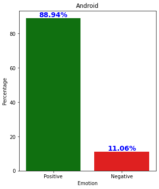
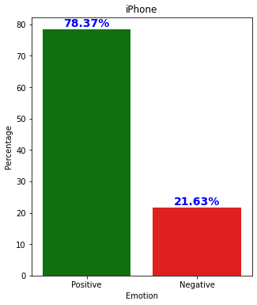

# Analysis of Tweets with NLP

**Author**: Samuel Song, Scotty Libby
 

## Overview

Using a series of tweets from an event called SXSW (tagged by #SXSW), this model uses NLP to first train the model to understand what is 'positive' or 'negative'. Then, busniesses can use the model on future tweets to further examine the positive/negative tweets and create graphs and insightful information.
 
The target audience would be for marketing for whichever company needs our sentiment analysis model.

## Data and Methods
Data provided had come from [data.world](https://data.world/crowdflower/brands-and-product-emotions).
 
The data was a CSV file of about 9000 rows. Each row had a 'tweet', 'sentiment toward brand', and 'sentiment' 
 
- 'Sentiment toward brand': a column in which the tweet is referring to whichever brand listed. In this particular dataset we had Apple, Google, and Android as the most popular ones
 
- 'Sentiment': the ground truth value of each tweet, labeled as either positive, negative, or neutral.
    - There was also a small handful of 'don't knows'. This was about 100 and was deemed unlabelable and ignored in the overall process.
 
- The initial data was labeled inconsistently in the middle column, which seemed to record if certain brands or devices were mentioned, but failed to record this information for the majority of the data. We coded a class in EDA/Prep to fill these NaN values

 
Each ground truth label was marked by a human, leaving room for inconsistency.
 

## Notebook Guide:
Please review the full analysis in the Jupyter Notebooks: 
- [Initial EDA](./code/EDA-Preparing.ipynb)
- [Work for best model](./code/Best_Model_Index.ipynb)
- [Work for visualizations](./code/Visualization.ipynb)
- [Folder containing all model attempts](./code/models/)

 

### EDA-Preparing
 
Lowercased and removed punctuation from tweets and saved outputs into data folder. Also filled in the middle column in this file.
 
 

### Best_Model_Index
 
Contains the work for finding the best model. There were many iterations before of different attempts, about 4 more notebooks worthy. They have been left out for the sake of space
 

 
 

### Visualization
All work for visualizations done here. Some examples below of our insights found on positive vs negative emotions
 

 
 
 

### Models
- [Initial Modeling](./code/models/1_Initial_Modeling_Notebook_Song.ipynb)
    - Began with 4 features
- [3 Feature Modeling](./code/models/3_Modeling_With_3_Targets.ipynb)
    - Attempt with 3 features
- [KMeans Classification Attempt](./code/models/2_Attemp_on_KMeans.ipynb)
    - Attempted to reclassify the neutral tweets with kmeans
- [Modeling 2 Target with Ensamble](./code/models/4_Modeling_2_Targets_With_Ensambling.ipynb)
    - Added the use of ensambles and continued with 2 targets
- [Scotty's modeling](./code/models/modeling_scotty.ipynb)
    - MNB, NN (keras), XGBoost for binary classifier.

## Results
Our best model had an accuracy of about 87%. (Binary classifier)
 
The multi-class model did quite worse, around 68%. With the limited time for the project and how inconsistent the data labeling of 'neutral' was, we decided to not use multiclassification
 
As for the results from the tweets strictly; mostly positive feelings for the brands Apple, Google, and Android at the event SXSW.

 

## Conclusions
- Twitter lingo can be tough for NLP tasks, but by highlighting keywords and removing unnecessary words, we trained a tuned model to label sentiment on tweets
- The data was initially inconsistent and missing values, but we programmatically filled in the empty values
- According to our data from this event, twitter consumers reacted more positively to Apple than Google, and less critical of the iPad than the iPhone

### Next Steps

- Re-Label neutral tweets
    - TRUE neutral could be classified as spam/advertisement/announcement, but the neutrals in this database were questionable. (Assumingly because humans had labeled them)
    - If we were to properly relabel the neutral labels again to respective positive, negative, or advertisement/announcement and retrain, I believe the model could be better
- Source more data!
    - The truth will always be: More data = better!
- Update the model
    - When a company has a new batch of tweets to analyze, including them into training the model will keep the model up to date and help improve it more.

For any additional questions, please contact Samuel Song at samueld.song@gmail.com and Scotty Libby at ScottyDebuggin@gmail.com
